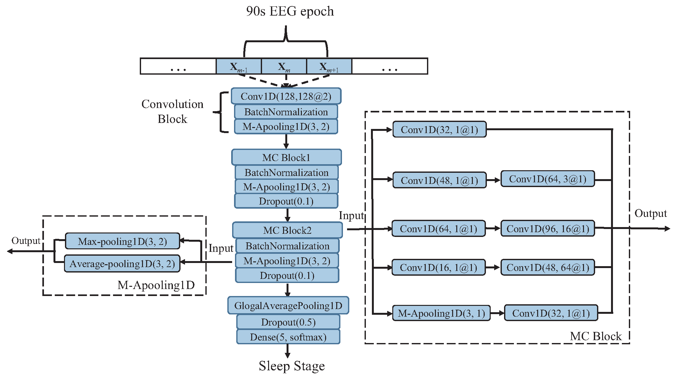

# SingleChannelNet #

Code for the model in the paper SingleChannelNet: A model for automatic sleep stage classification with raw single-channel EEG by Dongdong Zhou, Jian Wang, Guoqiang Hu, Jiacheng Zhang, Fan Li, Rui Yan, Lauri Kettunen, Zheng Chang, Qi Xu, Fengyu Cong.

This work has been accepted for publication in [Biomedical signal processing and control](https://www.sciencedirect.com/science/article/pii/S1746809422001148).

The structure of SingleChannelNet is shown as:

## Environment ##

## Environment ##

The following setup has been used to reproduce this work:

- Ubuntu 18.04 / Windows 10 1903 x64
- CUDA toolkit 10.0 and CuDNN v7.6.4
- Python 3.5.4 x64
- tensorflow-gpu (1.15.2)
- matplotlib (1.5.3)
- scikit-learn (0.19.1)
- scipy (1.4.1)
- numpy (1.18.2)
- pandas (0.25.3)
- mne (0.20.0)
- [tensorlayer](https://github.com/zsdonghao/tensorlayer) (optional)
- MongoDB (optional)
- [eAE](https://github.com/aoehmichen/eae-docker) (optional)

## Prepare dataset ##
We evaluated our SingelChannelNet with CCSHS and [Sleep-EDF](https://physionet.org/pn4/sleep-edfx/) dataset.

For the MASS dataset, you have to request for a permission to access their dataset. 
For the [Sleep-EDF](https://physionet.org/pn4/sleep-edfx/) dataset, you can run the following scripts to download SC subjects.

    cd data
    chmod +x download_physionet.sh
    ./download_physionet.sh

Then run the following script to extract specified EEG channels and their corresponding sleep stages.

    python prepare_physionet.py --data_dir data --output_dir data/eeg_fpz_cz --select_ch 'EEG Fpz-Cz'
    python prepare_physionet.py --data_dir data --output_dir data/eeg_pz_oz --select_ch 'EEG Pz-Oz'

## Get a summary ##
Run this script to show a summary of the performance of our DeepSleepNet compared with the state-of-the-art hand-engineering approaches. The performance metrics are overall accuracy, per-class F1-score, and macro F1-score.

    python summary.py --data_dir output
    

## Citation ##
If you find this useful, please cite our work as follows:

        @article{zhou2022singlechannelnet,
          title={Singlechannelnet: A model for automatic sleep stage classification with raw single-channel eeg},
          author={Zhou, Dongdong and Wang, Jian and Hu, Guoqiang and Zhang, Jiacheng and Li, Fan and Yan, Rui and Kettunen, Lauri and Chang, Zheng and Xu, Qi and Cong, Fengyu},
          journal={Biomedical Signal Processing and Control},
          volume={75},
          pages={103592},
          year={2022},
          publisher={Elsevier}
        }
## Licence ##
- For academic and non-commercial use only
- Apache License 2.0
